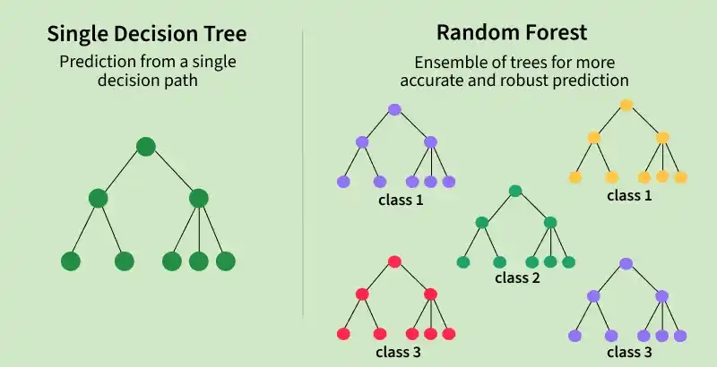

## Was ist Random Forest Regression?

**Idee:** Viele einfache Modelle → ein starkes Modell

- Ensemble-Modell: Viele Entscheidungsbäume arbeiten zusammen  
- Jeder Baum trifft eine eigene Vorhersage  
-   Am Ende zählt der **Durchschnitt**

---

## Ein Baum vs. viele Bäume

::: {.columns}
::: {.column width="50%"}

###   Single Decision Tree
- eine einzige Regelkette  
- neigt zu Overfitting  
- stark abhängig von Datenpunkten  

:::

::: {.column width="50%"}

###   Random Forest
- viele unterschiedliche Bäume  
- reduziert Varianz  
- robuster gegenüber Ausreißern  

:::
:::

---

## Warum viele Bäume stärker sind

- Training auf zufälligen Daten-Teilmengen  
- Zufällige Auswahl von Features pro Baum  
-   Kombination ergibt stabile Vorhersage  

---

## Mathematische Intuition

$$
F(x) = \frac{1}{N} \sum_{n=1}^{N} f_n(x)
$$

- $F(x)$ → finale Vorhersage  
- $f_n(x)$ → einzelner Baum  
- $N$ → Anzahl der Bäume  

---

## Beispiel: California Housing

**Ziel:** Vorhersage von Immobilienpreisen

- reale Daten  
- mehrere Einflussfaktoren  
- typisches Regressionsproblem  

---

## Umsetzung mit Scikit-Learn

Wir bauen das Modell Schritt für Schritt.

---

## 1. Daten laden

```python
data = fetch_california_housing()
X, y = data.data, data.target
```
Laden von California Housing Datensatz
Trennung in Features X und Y

---

## 2. Daten aufteilen

```python
X_train, X_test, y_train, y_test = train_test_split(
    X, y, test_size=0.2, random_state=42
)
```

Datensatz wird in Trainings und Testdaten getrennt

---

### 3. Model erstellen
```python
model = RandomForestRegressor(
    n_estimators=100,
    random_state=42
)
```

Definetion eines Random Forest mit 100 Bäumen als Grundkonfiguration

---

### 4. Modell trainieren & Vorhersagen treffen
```python
model.fit(X_train, y_train)
y_pred = model.predict(X_test)
```

Das Model lernt aus den Daten und trifft eine Vorhersage

---

### 5. Modell bewerten
```python
mse = mean_squared_error(y_test, y_pred)
r2 = r2_score(y_test, y_pred)
```

Messung der Modellqualität mit MSE (Fehler) und R² (Erklärungsgrad)

---

### Ergebnisse:
```{python}
#| echo: true
#| output-location: fragment
from sklearn.datasets import fetch_california_housing
from sklearn.model_selection import train_test_split
from sklearn.ensemble import RandomForestRegressor
from sklearn.metrics import mean_squared_error, r2_score

data = fetch_california_housing()
X, y = data.data, data.target

X_train, X_test, y_train, y_test = train_test_split(
    X, y, test_size=0.2, random_state=42
)

model = RandomForestRegressor(n_estimators=100, random_state=42)
model.fit(X_train, y_train)

y_pred = model.predict(X_test)

mse = mean_squared_error(y_test, y_pred)
r2 = r2_score(y_test, y_pred)

print("Mean Squared Error:", round(mse, 2))
print("R² Score:", round(r2, 2))
```

## Single Decision Tree vs. Random Forest

::: {.columns .align-center}
::: {.column width="40%"}

{width=90%}

:::

::: {.column width="60%"}

### Vergleich

- **Single Decision Tree:** ein einzelner Entscheidungsweg  
- **Random Forest:** viele Bäume + Mittelwert 

- -> reduziert Overfitting, stabilere Ergebnisse  

:::
:::

---

## Vor- und Nachteile

::: {.columns}
::: {.column width="50%"}

### Vorteile
- gut für komplexe Daten  
- robust gegenüber Ausreißern  
- reduziert Overfitting  

:::

::: {.column width="50%"}

### Nachteile
- „Black Box“  
- langsamer als einzelne Bäume  

:::
:::

---

## Fazit

  Random Forest = starkes Standardmodell

- viele schwache Modelle kombiniert  
- sehr gute Performance  
- wenig Tuning nötig